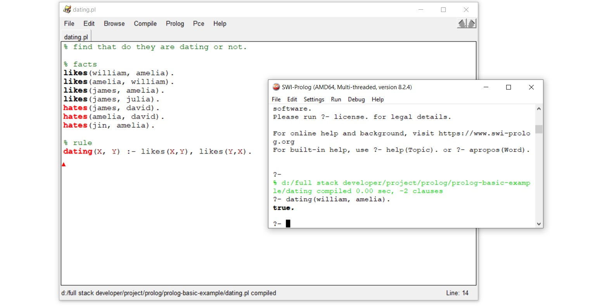

# Prolog-basic-example

Prolog or Programmation en Logique (Programming in Logic) is a logical programming language and declarative programming language which use in AI. Prolog has several different from our familiar programming language such as Python and JavaScript. Typically, The result of this language will be true and false because we usually ask questions that give the answers true or false in AI. For example, is a person that has blue eye be allergic to this cosmetics?. Moreover, prolog can use to solve many complex problem.

## Problem solved by Prolog
- general problem in programming languages (find the element in list, reveres a list)
- arithmetic - a list of prime numbers
- five house problem
- gray code
- huffman code
- tree
- graph
- eight queens problem
- knight's tour
- syntax checker
- sudoku
- crossword puzzle
