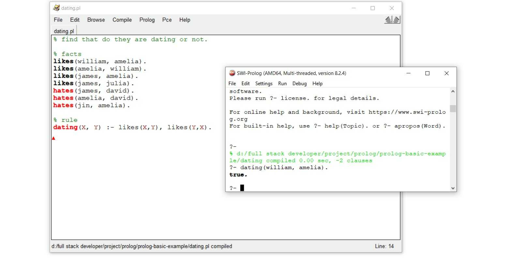

# Prolog-basic-example

Prolog or Programmation en Logique (Programming in Logic) is a logical programming language and declarative programming language which use in AI. Prolog has several different from our familiar programming language such as Python and JavaScript. Typically, The result of this language will be true and false because we usually ask questions that give the answers true or false in AI. For example, is a person that has blue eye be allergic to this cosmetics?. Moreover, prolog can use to solve many complex problem. 

In this repository, I keep my examples that be used in my Medium articles. Please feel free to explore and understand Prolog.

## My Prolog Lesson
I had wrote down my articles in Medium about Prolog which help people learn Prolog better with simple explanation and clear examples.
- [[Prolog] มาเริ่มเรียนรู้ภาษา Prolog กันเถอะ!](https://medium.com/neverrest/prolog-มาเริ่มเรียนรู้ภาษา-prolog-กันเถอะ-149e6de985a) - Prolog concept and how to install IDE for Prolog.
- [[Prolog] เริ่มต้นเขียนโปรแกรมด้วยภาษา Prolog พร้อมรู้จักกับ Facts, Rules และ Queries](https://medium.com/neverrest/prolog-เริ่มต้นเขียนโปรแกรมด้วยภาษา-prolog-พร้อมรู้จักกับ-facts-rules-และ-queries-fa8cd1e39531) - Symbols, Data types, Facts, Rules and Queries
- [[Prolog] การใช้ Variables ใน Prolog](https://medium.com/neverrest/prolog-การใช้-variables-ใน-prolog-152f5652f8a8) - variables, anonymous variable
- [[Prolog] Structure and Equality](https://medium.com/neverrest/prolog-structure-and-equality-8d4636fcf45d) - Structure and Equality
- [[Prolog] Arithmetic and Relational Operators สัญลักษณ์ทางคณิตศาสตร์พื้นฐานใน Prolog](https://medium.com/neverrest/prolog-arithmetic-and-relational-operators-สัญลักษณ์ทางคณิตศาสตร์พื้นฐานใน-prolog-d9341be0b097) - arithmetic and relational operators
- [[Prolog] List in Prolog](https://medium.com/neverrest/prolog-list-in-prolog-dbca1d203f73) - List, SWISH web application

## Problem solved by Prolog
- general problem in programming languages (find the element in list, reveres a list)
- arithmetic - a list of prime numbers
- five house problem
- gray code
- huffman code
- tree
- graph
- eight queens problem
- knight's tour
- syntax checker
- sudoku
- crossword puzzle
